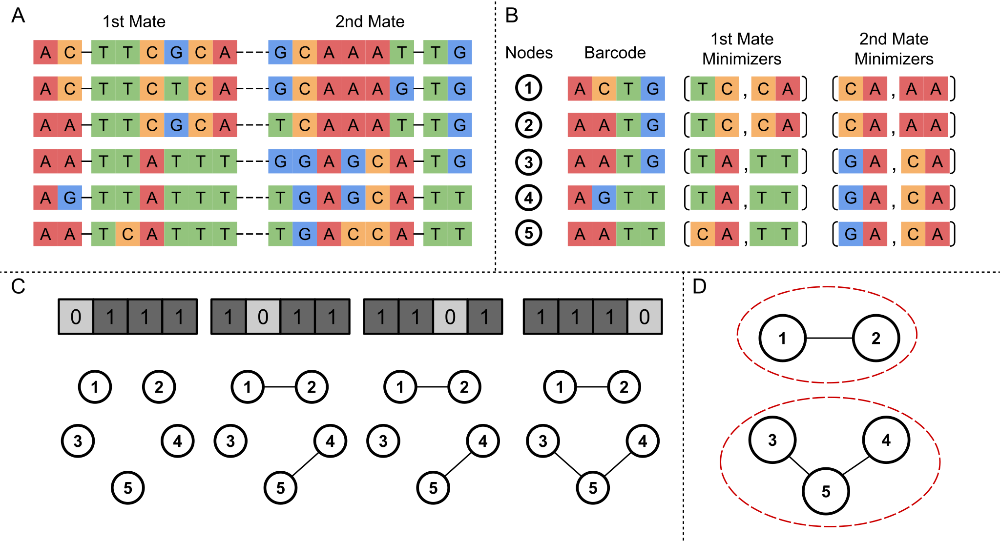

# Calib parameter selection

## Peak into Calib clustering algorithm

Calib clusters reads by defining **barcode similarity** and **sequence similarity** between a given pair of reads. First, let's define barcode and sequence:

- A read's barcode is its first barcode tag concatenated to its second barcode tag
- A mate's sequence is the sequence that starts after the barcode tag

Then define barcode and sequence similarities: 

- Two barcodes are considered similar if they are no more than `-e` (or `--error-tolerance`) [Hamming distance](https://en.wikipedia.org/wiki/Hamming_distance) from one another
- Two sequences are considered similar if at least  `-t` (or `--minimizer-threshold`) of their ordered `-m` (or `--minimizer-count`)  minimizers are identical.

Then we define read similarity as:

- Two reads are considered similar if their:
  - Barcodes are similar
  - First mates' sequences are similar
  - Second mates' sequences are similar

Which leaves us with explaining what minimizers are:

- A minimizer is defined as the lexicographically smallest substring of size `-k`  (or `--kmer-size`) in a given string

To extract minimizers of a mate sequence:

- Split the sequence into `-m` segments of equal size
- Extract a minimizer from each segment

Thus each mate will have an ordered list of `-m` minimizers.

Calib has each read represented in a node on an undirected graph, with an edge added for any two nodes with similar reads. Then each connected component is considered as a cluster. 


The algorithm is summarized in the following figure:



> **Calib clustering of paired-end reads of UMI tagged DNA molecules**.
>
> A) In this example, 6 paired-end reads are given to Calib as input. Each read has two mates. Since each mate comes from the start of the tagged molecule (with tag length of 2 in this example), the first two nucleotides are the tag, and the rest is the sequence.
>
> B) From the two mates of each read, the barcode is extracted. The barcode is a concatenation of both mates' tags. From each mate, Calib extract an ordered list of minimizers. In this example `-k` is 2; and `-m` is 2. The first two reads have identical barcodes and minimizers, and thus will be represented by a single node (node 1).
>
> C) With `-e` of 1; and barcode tag length, `-l`, of 2 (barcode length of 4), there are 4 possible templates. When processing each template, all pairs of nodes that have identical barcodes, after removing the bases ignored by the template, will be checked to see if they have enough matching minimizers. In this example `-t` is 1. In the first template, only nodes 2 and 3 have identical masked barcodes but they do not have enough matching minimizers.
>
> D) Once all edges are processed, Nodes in a connected component are considered as a cluster. Reads represented by nodes in a cluster are considered to be originating from the same UMI tagged molecule.

## Selection of pre-configured parameter sets

As explained, Calib has four clustering parameters that need to be set. If no clustering parameters are passed to Calib, Calib will automatically selects its own parameters based on the the barcode length and inferred read length. The selection of the parameter was done using extensive testing of wide range of possible parameters. Basically, we tested 9 different dataset types by using:

- Barcode tag lengths of 4, 8, or 12
- Read mate length of 75, 150, or 250
Then, for each dataset type, we generated 10 different datasets, each using a different random seed.
We then ran Calib on each of these sets using:
- Error tolerance of 1 or 2
- k-mer size of 4 or 8
- Minimizer count of:
  - 3 with thresholds of 1 or 2
  - 4 with thresholds of 1, 2, or 3
  - 5 with thresholds of 2, 3, or 4
  - 6 with thresholds of 2, 3, 4, or 5
  - 7 with thresholds of 2, 3, 4, 5, or 6

The complete results of 68 different parameter sets on the 10 different random seeds of each of the dataset types in this directory's TSV files.
The results are plotted in these [plots](https://cdn.rawgit.com/vpc-ccg/calib/master/experiments/parameter_tests/parameter_plots.html) (note that the file plots HTML file can also be access by just right-click and saving the link [here](https://raw.githubusercontent.com/vpc-ccg/calib/master/experiments/parameter_tests/parameter_plots.html) ).
In these plots, we filtered out any parameter set that scored less than 0.99/1.00 in any of the 10 random seeds on a given dataset type.

Based on these results, we preconfigured Calib with the following default parameter selection:
```C++
if (barcode_length >= 1 && barcode_length <= 6) {
    if (mean_read_size >= 61 && mean_read_size <= 100) {
        error_tolerance     = 1;
        kmer_size           = 4;
        minimizer_count     = 6;
        minimizer_threshold = 2;
    }
    if (mean_read_size >= 101 && mean_read_size <= 150) {
        error_tolerance     = 1;
        kmer_size           = 8;
        minimizer_count     = 7;
        minimizer_threshold = 2;
    }
    if (mean_read_size >= 151 && mean_read_size <= 250) {
        error_tolerance     = 1;
        kmer_size           = 8;
        minimizer_count     = 7;
        minimizer_threshold = 2;
    }
}
if (barcode_length >= 7 && barcode_length <= 11) {
    if (mean_read_size >= 61 && mean_read_size <= 100) {
        error_tolerance     = 2;
        kmer_size           = 4;
        minimizer_count     = 7;
        minimizer_threshold = 3;
    }
    if (mean_read_size >= 101 && mean_read_size <= 150) {
        error_tolerance     = 2;
        kmer_size           = 8;
        minimizer_count     = 7;
        minimizer_threshold = 2;
    }
    if (mean_read_size >= 151 && mean_read_size <= 250) {
        error_tolerance     = 2;
        kmer_size           = 8;
        minimizer_count     = 7;
        minimizer_threshold = 2;
    }
}
if (barcode_length >= 12) {
    if (mean_read_size >= 61 && mean_read_size <= 100) {
        error_tolerance     = 2;
        kmer_size           = 4;
        minimizer_count     = 7;
        minimizer_threshold = 3;
    }
    if (mean_read_size >= 101 && mean_read_size <= 150) {
        error_tolerance     = 2;
        kmer_size           = 4;
        minimizer_count     = 7;
        minimizer_threshold = 3;
    }
    if (mean_read_size >= 151 && mean_read_size <= 250) {
        error_tolerance     = 2;
        kmer_size           = 8;
        minimizer_count     = 7;
        minimizer_threshold = 2;
    }
}
```

Note that `mean_read_size` if the average read length of the first 10,000 reads in the first FASTQ file.
This preconfiguration is what we deemed suitable tradeoff between accuracy, time, and memory use, with more preference on better accuracy than on better time or memory.
Please feel free to select a different set of parameters based on the plot results if that suits your application more.

## Testing other parameters and dataset types

If you wish to test other parameters you can use parameter selection testing script available [here](../../slurm_scripts/).
