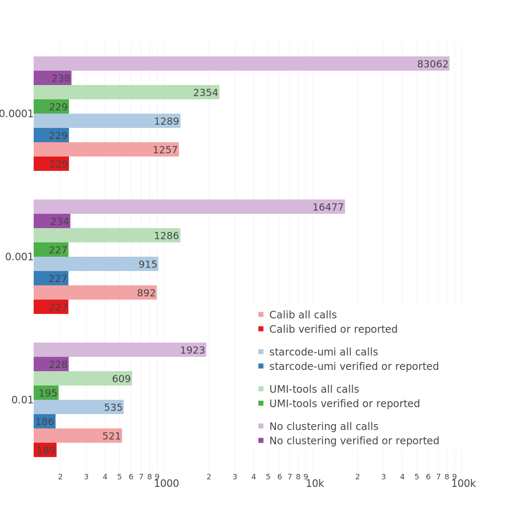

# Real dataset tests

This directory includes the following:

- Two TSV files of verified or reported SNV's on HD701 by Horizon Discovery. Only mutations that overlapped with the regions in covered by the 36-gene panel we used for this dataset generation were kept. The TSV file columns are:
  - Chromosome
  - hg19 reference position
  - Reference base
  - Mutation base
  - Cosmic ID of this SNV
  - Whether the base was complemented because COSMIC has this base on the reverse complement strand
- TSV file of SiNVICT calls from every tools tests here using no SiNVICT filters, and at different sequencing errors

The results are summarized in this figure:

> **SiNVICT calls using different clustering methods on the real dataset.**
> The X axis is in logarithmic scale representing the number of calls. The Y axis shows the choice for SiNVICT expected sequencing error rate. Each method is shown in a different color, with light colors representing all calls made by SiNVICT, and solid colors represent a subset of those calls that are on the list of 255 SNV's of verified or reported mutations in HD701 that intersect with the 36-gene panel.

## Running real dataset tests

Please check the testing script available [here](../../slurm_scripts/)